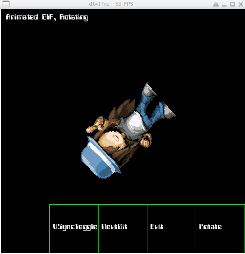

# spriteutil

Just a few things for use with `faiface/pixel` 2D library

### Animated GIF in Pixel

Using github.com/faiface/pixel we can display animated GIF images!

```go
import (
    "github.com/aerth/spriteutil"
)

func run(){
// ...
sprite, err := spriteutil.LoadGif(file)
if err != nil { return err }
sprite.Update(dt)
sprite.Draw(win, pixel.IM)
// ...
}
```




Image/Font Credits:

  * https://i.giphy.com/media/gz7cJzQSlLmcE/source.gif
  * https://www.spriters-resource.com/images/light/misc/select1.gif
  * https://www.dafont.com/computerfont.font
